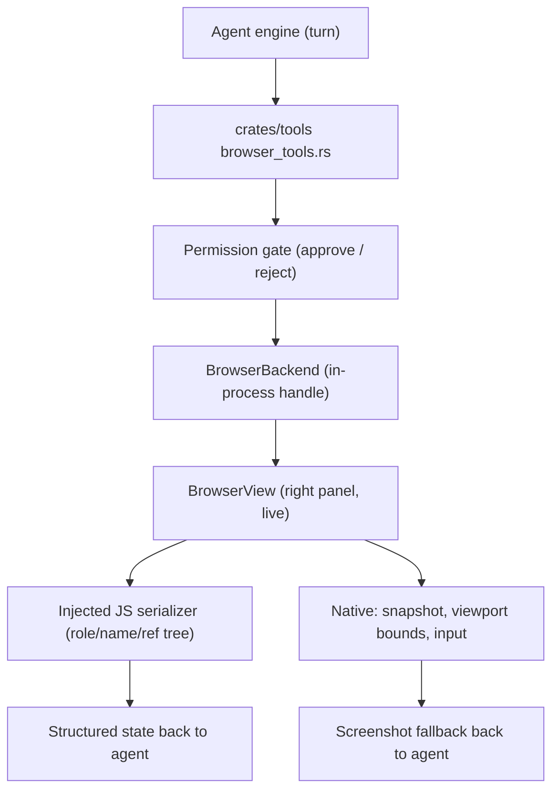
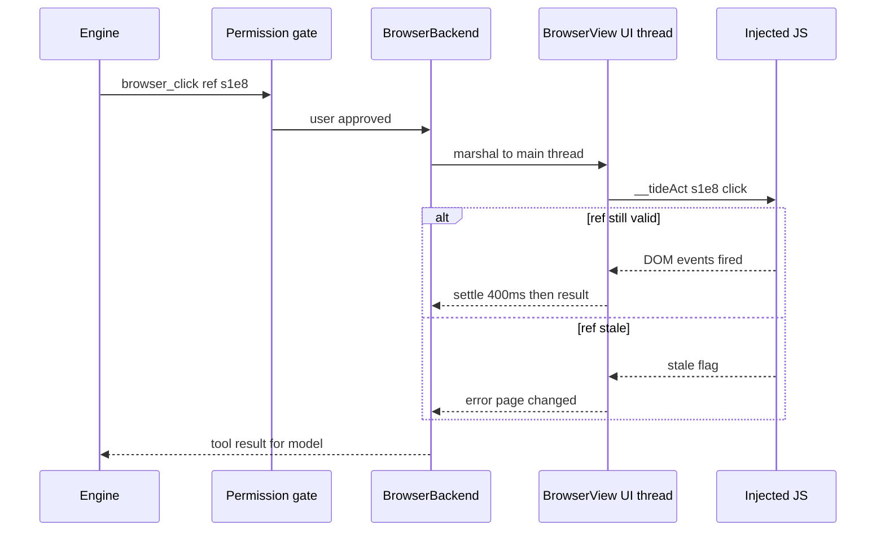
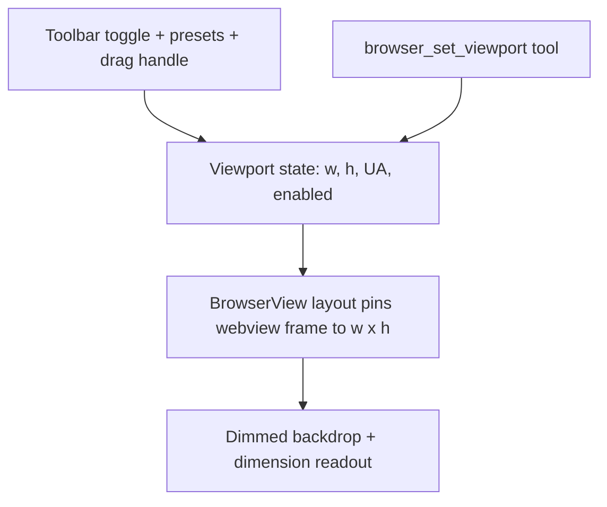

# Agentic Browser + Device Mode — Design

Validated 2026-09-10 over a brainstorming session. Scope: turn the embedded
right-panel browser into an agent-controllable surface (navigate, read
structured page state, act on elements, screenshot) and add a Chrome
DevTools-style device mode with free viewport sizing. The browser today
(`src/browser.rs`, 2,855 lines) is a capable single-page viewer — omnibox,
back/forward/reload, devtools, downloads, start page, Mermaid rendering —
with no history, bookmarks, find-in-page, or tabs. Those stay out of scope.

## Decisions

- **In-process tool bridge (approach A).** A new `BrowserBackend` seam in
  `crates/tools`, mirroring `ComputerBackend`
  (`crates/tools/src/tools/computer.rs:16` — trait, `RwLock<Option<Arc<_>>>`
  slot at :23, installer/accessor at :27/:34). The UI installs the backend at
  boot; the engine's `browser` tool calls route to the active right-panel
  `BrowserView`. Rejected: CDP automation (WebView2-only, two stacks);
  reusing the macOS computer-use helper on our own window (accessibility
  can't see inside webviews, macOS-only, zero DOM structure).
- **JavaScript is the DOM layer.** One injected serializer produces a
  role/name/ref tree (Playwright-aria-snapshot style); identical code runs on
  WKWebView and WebView2. Native APIs only for what JS can't do: screenshots
  and viewport bounds.
- **Permission gate reuse.** Tool calls flow through the existing
  approve/reject driver pattern (`run_computer_tool` /
  `crates/backend/src/driver/mod.rs:98`), so the user commands what the agent
  does on the live surface they're watching.
- **Auto-wait, not a wait tool.** Navigate waits for the platform load event;
  click/type/scroll settle ~400 ms for DOM quietness. Models use explicit
  `wait_for` tools poorly (Playwright's lesson).
- **Snapshot-scoped refs.** Refs (`s1e8` = snapshot 1, element 8) are valid
  only within the snapshot that produced them; staleness returns one error
  shape ("page changed, call `browser_get_state` again").
- **One shared viewport state.** The user's device-mode toggle and the
  agent's `browser_set_viewport` drive the same code path; the toggle flips
  on when the agent sets a viewport.
- **v1 limits (deliberate):** no touch-event synthesis, no device-scale-factor
  emulation, top-frame DOM only (cross-origin iframes unreachable), http/https
  URLs only, single active surface (no tabs exist today), Linux returns
  "browser unavailable" matching the current stub.

## Tool surface

| Tool | Behavior |
|---|---|
| `browser_navigate(url)` | Load URL, wait for load event; opens a browser surface via `open_right_panel_surface` (`RightPanelSurface::Browser(Uuid)`, `src/app.rs:525`) if none is active |
| `browser_get_state()` | Role/name/ref tree + URL, title, viewport size, ready state |
| `browser_screenshot()` | PNG of the current viewport |
| `browser_click(ref)` | Click by ref; auto-settles |
| `browser_type(ref, text, submit?)` | Focus, clear, type; optional Enter |
| `browser_press_key(key)` | Keyboard event synthesis |
| `browser_scroll(direction, amount?)` | Page/element scrolling |
| `browser_set_viewport(w, h)` | Pins viewport, enabling device mode |

## Architecture



### The ref-tree serializer (injected JS)

One script injected at document-start on both platforms — a
`WKUserContentController` user script on macOS,
`AddScriptToExecuteOnDocumentCreatedAsync` on WebView2. Host-injected scripts
bypass page CSP on both platforms. It exposes two functions:

- **`__tideSnapshot()`** — walks the visible DOM, derives ARIA-ish roles from
  tags plus ARIA attributes (`button`, `link`, `textbox`, `checkbox`,
  `combobox`, `heading`, `img`, `list`, `navigation`, `text`, …); names
  resolve as `aria-label` → `alt`/placeholder → trimmed innerText capped
  ~80 chars. Each entry gets a snapshot-scoped ref; elements are stored in an
  in-page `ref → element` map. Token discipline: cap ~300 nodes / depth 12,
  skip `aria-hidden` / `display:none` / zero-size, flag `truncated`.
- **`__tideAct(ref, action, payload)`** — resolves the ref, verifies the
  element is still connected **and** role+name still match, then performs the
  action. Missing ref or mismatch returns the single stale error shape.
  Navigation wipes the map for free (new document re-injects the script).

Example `browser_get_state` payload:

```json
{
  "url": "https://example.com/login",
  "title": "Sign in",
  "viewport": { "w": 1280, "h": 800 },
  "ready": "complete",
  "tree": [
    { "ref": "s1e2", "role": "heading", "name": "Sign in", "level": 1 },
    { "ref": "s1e5", "role": "textbox", "name": "Email", "value": "" },
    { "ref": "s1e8", "role": "button", "name": "Continue" }
  ]
}
```

Input synthesis stays in-page: click = `scrollIntoView` + full pointer/mouse
event sequence (not `.click()` — frameworks listen for pointerdown); typing =
focus + select-all + per-char `insertText`, falling back to the native value
setter + `input` event (React-safe). Known limit: pages filtering on
`isTrusted` ignore synthesized events; the escape hatch is native input
forwarding using `getBoundingClientRect` coordinates, which the WebView2 host
already has.

### Platform bridge and threading

The seam's synchronous `invoke` arrives on the engine thread; every call
marshals to the UI thread and blocks on a reply channel with a timeout. One
`BrowserBackend` impl, both platforms:

| Concern | macOS (WKWebView) | Windows (WebView2) |
|---|---|---|
| Script eval | existing evaluate-JavaScript path | `ExecuteScriptAsync` |
| Injection | user script at document-start | document-created script |
| Screenshot | existing snapshot code, packaged like computer-use images | `CapturePreview` (already present) |
| Load wait | `WKNavigationDelegate` didFinish | `NavigationCompleted` |
| UA override (presets) | `customUserAgent` | CoreWebView2 settings |

All public APIs on the macOS side — no private calls. The bridge targets the
single active `BrowserView`.



## Device mode (viewport control)



- **Off (default):** current behavior — webview fills the right panel.
- **On:** the webview frame is pinned to exact CSS pixels, centered with a
  dimmed backdrop and live `w × h` readout; edge drag handle resizes freely
  (whole-pixel snap); free-entry width/height fields for exact numbers.
- **Presets:** iPhone 390×844, Pixel 412×915, iPad 820×1180, Laptop
  1280×800, Desktop 1920×1080. Mobile presets also swap in a mobile UA
  string — that is what makes responsive sites serve their mobile layout.
- **Units:** frame sized in points/DIPs so CSS px matches on both platforms
  regardless of DPI; page zoom stays orthogonal.
- **Persistence:** last viewport and toggle state survive restarts via
  settings.

## Rollout and testing

Four milestones, each shippable:

1. **Vertical slice (macOS):** seam + serializer + `navigate` / `get_state` /
   `screenshot`. The serializer is plain JS tested against fixture HTML with
   golden-file JSON trees (role derivation, staleness, truncation caps); the
   backend trait makes tool plumbing mockable in `crates/tools` tests.
2. **Actions:** `click` / `type` / `press_key` / `scroll` + permission gate +
   settle/staleness loop. Fixtures: a plain form page, a React SPA (typing
   path), an isTrusted-filtering page (documents the known limit).
3. **WebView2 parity:** same script, native side per the table above.
4. **Device mode:** toolbar UI + `browser_set_viewport` + presets +
   persistence.

Integration tests spin up a tiny localhost server for fixtures (keeps the
http/https-only rule intact).

## Future work (v2, out of scope)

Touch-event synthesis and device-scale-factor emulation, multi-tab sessions,
find-in-page, history and bookmarks.
