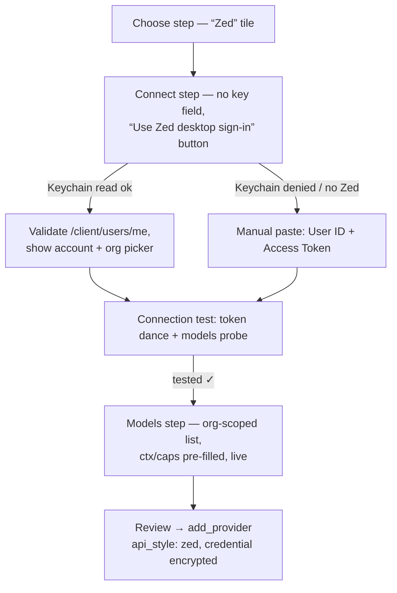
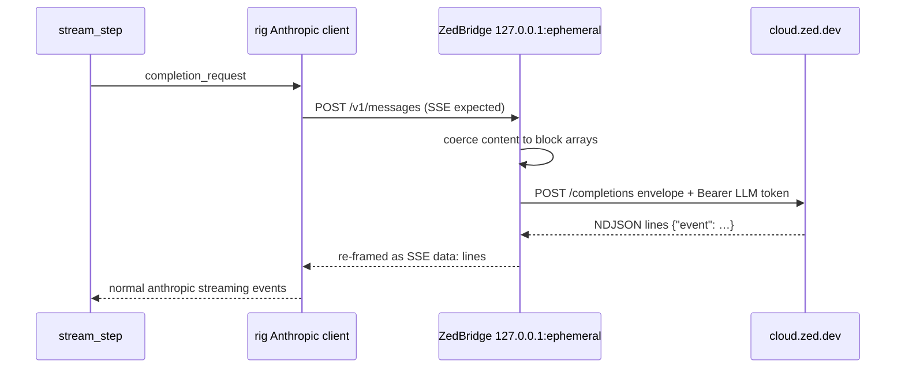

# Zed Native Provider — Design

Date: 2026-09-11
Status: validated against the live `cloud.zed.dev` API (Zed 1.19.2, macOS)

## Summary

Add a third provider style, `zed`, that talks to Zed's cloud AI infrastructure
directly using the local Zed desktop's credentials — no proxy binary
(`zed-openai-api` or otherwise). A user signed into Zed desktop adds the
provider in one click: tide reads the credentials from the macOS Keychain,
validates them, offers an organization picker, and lists every model on the
user's plan with full context-window/capability metadata.

Why not the existing OpenAI protocol: `cloud.zed.dev` is not
OpenAI-compatible. It has its own auth (userId + access token → short-lived
LLM token), its own request envelope, per-family native request bodies, and
NDJSON rather than SSE streaming. All of this was verified live (see below).

## Verified API facts

Everything below was confirmed by curl against `cloud.zed.dev` on this
machine, using the credentials Zed desktop stores.

**Credentials (macOS).** Zed desktop (1.19.2) stores an *internet password*
in the login Keychain: `srvr = https://zed.dev`, account = numeric user id
(e.g. `605409`), password = 135-char access token. Readable via
`/usr/bin/security find-internet-password -s https://zed.dev -w` — no new
Rust dependency needed.

**Token dance.**

- `POST /client/llm_tokens` with header `Authorization: "{userId} {accessToken}"`
  (not Bearer) and optional JSON body `{"organization_id": …}` → `{token}`:
  a 1255-char JWT, short-lived.
- `GET /client/users/me` with the same auth → account info, feature flags,
  organizations (see below).
- `GET /models` with `Authorization: Bearer {llmToken}` → 16 models with
  `max_token_count`, `max_output_tokens`, `supports_tools`,
  `supports_images`, `supports_thinking` — maps 1:1 onto `TideModelWire`
  (`context_window`, `vision`, `reasoning`, `match_state: "live"`).

**Completions.** `POST /completions` with Bearer LLM token and body
`{intent: "user_prompt", provider, model, provider_request}` where
`provider_request` is the native format per family. For Claude models it is
the standard Anthropic Messages body, with one quirk we hit live: message
content must be a **block array** — a plain string content is rejected with
`400 "expected a sequence"`, stricter than real Anthropic. Headers sent:
`x-zed-version`, `x-zed-client-supports-status-messages: true`.

**Streaming.** NDJSON lines, each `{"event": {…}}` where the inner event is
**verbatim an Anthropic SSE event** (`message_start`, `content_block_start`,
`content_block_delta`, `content_block_stop`, `message_delta`, `message_stop`,
`ping`). Verified end-to-end: claude-haiku-4-5 answered.

**Token refresh.** Recreate the LLM token on HTTP 401 or the
`x-zed-expired-token` / `x-zed-outdated-token` response headers. If
`llm_tokens` itself returns 401/403, the stored access token is dead (user
signed out) → surface "Zed sign-in expired".

**Organizations.** `GET /client/users/me` returns `organizations`
(id, name, is_personal), `plans_by_organization`, and
`default_organization_id`. Passing `organization_id` in the `llm_tokens`
body scopes the resulting JWT (verified: org → `organization_id: org_…,
plan: zed_vip`; personal org → `organization_id: null,
plan: token_based_zed_student`). Billing and model access ride on the token;
`/completions` takes no org field.

**Zed's own local port.** Zed desktop listens on a localhost TCP port
(e.g. 44438) — that is a private RPC socket, not an HTTP API. Not usable.

## Add-provider dialog

- **Choose:** new `TidePreset { id: "zed", name: "Zed", api_style: "zed",
  base_url: "https://cloud.zed.dev", requires_key: false, routing:
  Some(("zed", &["claude"])) }` (routing filters the Models step to Claude
  ids — see Scope). Tile grouped with aggregators; Zed logo asset.
- **Connect:** every other provider asks for an API key; Zed shows a
  **"Use Zed desktop sign-in"** button instead. It shells
  `security find-internet-password`, validates via `/client/users/me`, and
  displays the signed-in account. Base URL is not shown — nothing to
  configure. Fallback (Keychain denied, no Zed installed, headless): two
  manual paste fields, User ID + Access Token (the values
  `zed-openai-api`'s `extract-credentials.sh` prints).
- **Org selector:** if `/client/users/me` lists more than one organization,
  a picker appears under the account line — rows show name, plan badge from
  `plans_by_organization`, and a "Personal" tag for `is_personal`;
  preselects `default_organization_id`. Single org → auto-selected silently.
  The Models fetch runs **after** org selection, using that org's LLM token,
  so the list is org-scoped by construction (plans differ: zed_vip vs
  zed_student).
- **Duplicate adds:** wanting personal and VIP orgs simultaneously is
  legitimate — the Zed preset opts out of the wizard's `preset_added`
  base-URL dedupe so "Zed (VIP)" and "Zed (Personal)" can coexist. Editing
  re-runs sign-in + picker to switch orgs.
- **Models:** existing fetch machinery; every row arrives "From-provider"
  with real context windows and capability flags; recommended pre-checks:
  `claude-sonnet-5`, `claude-sonnet-4-6`.
- **Review/add:** `add_provider` persists `api_style: "zed"`,
  `base_url: "https://cloud.zed.dev"`, `encrypted_key =
  encrypt_stored(json{userId, accessToken, organizationId})`.

## Engine request-time

rig is the engine's only HTTP path (churn firewall), and the engine already
has both a logical-vs-transport URL seam (`from_config_with_transport`,
built for the SSE fixture recorder) and a localhost TCP responder pattern
(`mock_sse.rs`). So the Zed style is transport, not protocol: rig's real
Anthropic client does all request building and stream parsing; a tiny
in-process bridge translates Zed's framing.

- **Model wiring:** `ProviderApiStyle::Zed` arm in
  `EngineModel::from_config_with_transport`. Logical base URL stays
  `https://cloud.zed.dev` (quirk's thinking-host allowlist admits it);
  transport routes to the bridge. Prompt caching, thinking, tool_use,
  images work unchanged because rig is doing the real work.
- **The bridge** (one shared instance per credential, Arc + keep-alive
  handle, std-TcpListener like `mock_sse.rs`):
  1. map model id → provider family (`claude*` → `anthropic`;
     v1 routing guarantees this),
  2. coerce message content to block arrays (the verified 400 quirk),
  3. wrap the body in `{intent, provider, model, provider_request}`,
  4. send `x-zed-version` + status-message headers,
  5. re-frame NDJSON `{"event":…}` lines as SSE `data:` lines back to rig.
- **Token lifecycle** in the bridge: LLM token cached; recreated on
  401 / `x-zed-expired-token` (one retry per request). `llm_tokens` 401/403
  → step errors "Zed sign-in expired"; the UI offers Keychain re-read or
  manual paste to overwrite the stored pair.

## Storage & credentials

- **Zero schema changes.** `StoredProvider.encrypted_key` (existing column)
  holds `encrypt_stored(json{userId, accessToken, organizationId})`.
  `EngineModelConfig.api_key` carries the decrypted blob; the bridge parses
  it. Request-time never touches the Keychain.
- **Backend command** `zed_sign_in_from_keychain`: shells
  `/usr/bin/security find-internet-password -s https://zed.dev -w`,
  validates `/client/users/me`, returns account + organizations +
  default org to the wizard via the existing `TideOpsEvent` channel.
  macOS shows its usual permission prompt on first read; "Always Allow"
  makes it one-time. `parse_api_style` gains `"zed"`.
- **Re-auth:** on "Zed sign-in expired", the provider row offers the same
  Keychain re-read to overwrite the stored pair.

## Testing

- **Bridge unit tests** against a std-TcpListener fake cloud (injectable
  `CLOUD_URL`): assert the envelope, the block-array coercion, and
  NDJSON→SSE framing on captured wire bodies (the `mock_sse.rs` capture
  pattern).
- **Engine fixture tests**: Zed fixtures through full `stream_step`,
  including 401 → token-recreate → retry.
- **Live smoke**: the curl sequence from this design (users/me →
  llm_tokens → models → haiku completion) becomes a documented manual
  script, not an automated test.

## Scope & follow-ups

- **v1 is Claude-only.** Zed's cloud accepts Anthropic format natively for
  Claude models; GPT models need OpenAI *Responses* API conversion and
  Gemini models need native Gemini conversion in the bridge. The preset's
  `routing` needles (`["claude"]`) filter the Models step — the OpenCode
  Zen precedent. GPT/Gemini support is a follow-up bridge feature.
- The `open-ai-responses-api` and `cloud-thinking-effort` feature flags
  from `/client/users/me` hint at server-side capabilities worth adopting
  later; out of scope.
- `cloud.zed.dev` is an undocumented internal API — it churns (hence the
  `x-zed-outdated-token` machinery). The bridge isolates that churn to one
  file.

## Live smoke findings (2026-09-11, Task 17)

- **Thinking is accepted.** A thinking-enabled Claude turn through
  `/completions` returns HTTP 200 — no `thinking` stripping needed in
  `coerce_block_arrays` (the contingency in the implementation plan's
  Task 11 note is moot).
- **Org scoping confirmed end-to-end.** A personal-org token now fails
  with `token_spend_limit_reached` (403, Student plan), while the same
  request with an `organization_id`-scoped LLM token (Zed VIP) succeeds —
  the org selector is what makes the provider usable when the personal
  allocation is exhausted.
- **Stream framing varies: bare vs wrapped.** Live completions were
  observed as bare Anthropic events (`{"type":"message_start",…}`), not
  only the `{"event":{…}}` wrapper the first probe showed. `read_ndjson`
  now accepts both framings (regression test:
  `bridge_accepts_bare_anthropic_ndjson_lines`).
- **First-token latency** is dominated by model queueing (~3.7 s TTFB on
  a fast model); the bridge's read-all-then-emit buffering adds
  imperceptible overhead. No incremental streaming rewrite needed for v1.
