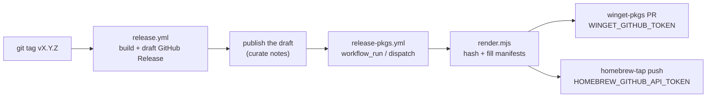

# Packaging manifests (winget · homebrew)

Distributes Tide's existing GitHub Release installers to the OS package
managers so users can install with:

```
winget install Tide.Tide                        # Windows (x64 + arm64)
brew install --cask code-with-current/tap/tide  # macOS (Apple Silicon + Intel)
```

winget and homebrew use small manifest files pointing at the installers the
`v*` release flow already publishes (see `.github/workflows/release.yml`).
The manifests are kept in sync with each release by
`.github/workflows/release-pkgs.yml`, which wakes via `workflow_run` when the
"Release" workflow succeeds on a `v*` tag (draft releases are skipped —
publish the draft, then re-run via `workflow_dispatch`).

> macOS uses our own tap (`code-with-current/homebrew-tap`) rather than the
> official `Homebrew/homebrew-cask`, which has notability requirements that
> Tide doesn't meet yet.

```
packaging/
├── README.md                         ← this file
├── render.mjs                        ← substitutes @@MARKERS@@ + hashes release assets
├── winget/
│   ├── Tide.Tide.yaml                ← version manifest   ┐ these three form one
│   ├── Tide.Tide.installer.yaml      ← installer manifest │ winget "version dir"
│   └── Tide.Tide.locale.en-US.yaml   ← default locale     ┘
└── homebrew/
    └── tide.rb                       ← Homebrew cask
```

The templates use `@@MARKER@@` placeholders. `render.mjs` downloads each
release asset, streams it through sha256, fills the markers, and writes the
result under `packaging/out/` (gitignored). Run it locally to preview a
release:

```bash
node packaging/render.mjs --version 0.4.0-beta.1 --repo code-with-current/tide
# → packaging/out/{winget,homebrew}/…
```

## Artifact inventory

`render.mjs` hashes exactly what the live release publishes (standard Tauri
bundler names; the deb has no manifest consumer yet):

| Asset | Platform | Consumer |
|---|---|---|
| `Tide_<version>_aarch64.dmg` | mac arm64 | homebrew cask (`on_arm`) |
| `Tide_<version>_x64.dmg` | mac x64 | homebrew cask (`on_intel`) |
| `Tide_<version>_x64-setup.exe` | win x64 | winget (NSIS) |
| `Tide_<version>_arm64-setup.exe` | win arm64 | winget (NSIS) |
| `Tide_<version>_amd64.deb` | linux amd64 | — (meta.json only, for now) |

The `Tide_<version>_<arch>-portable.zip` published beside the Windows setup
is NOT hashed — it wraps the bare app exe (a portable app, not an installer)
and has no package-manager consumer.

Partial releases are tolerated: the cask needs BOTH dmgs and the winget
installer manifest needs BOTH setup exes (release.yml uploads its build
matrix all-or-nothing, so in practice they exist together) — a missing asset
disables that platform's manifests with a warning, `meta.json` records
`platforms: { homebrew, winget }`, and the workflow skips that platform's
submission job. If nothing can be hashed, `render.mjs` exits 1.

## How a release flows

1. You tag `vX.Y.Z` and push it. `release.yml` builds the installers
   per target and attaches them to one DRAFT GitHub Release.
2. When that workflow finishes, `release-pkgs.yml` wakes up via
   `workflow_run`. If the release is still a draft it skips with a notice
   (draft asset URLs don't resolve); after you publish the release, re-run
   the workflow via `workflow_dispatch` (tag defaults to the latest
   published release) to parse the version and run `render.mjs` once, then
   submit the winget and homebrew manifests.
3. Each manifest submission is **gated on a secret** — until you add the
   secret, that platform is skipped with a notice.



## One-time setup (per platform)

### Windows — winget (`Tide.Tide`)

The Windows artifact is Tauri's NSIS installer, so winget consumes it
directly — no zip/nested-installer wrapping:

```yaml
InstallerType: nullsoft
InstallerSwitches:
  Silent: /S            # standard NSIS silent switch
```

Tauri's NSIS installs per-user (`Scope: user`) and registers an ARP entry
(DisplayName `Tide`, DisplayVersion `<version>`), which winget matches
against.

1. Make sure the latest release is published (so the setup.exe URL exists).
2. First submission (opens a PR to `microsoft/winget-pkgs`): PR the rendered
   files under `packaging/out/winget/` into `manifests/t/Tide/Tide/<version>/`
   by hand, or just let the workflow do it once the secret is set. Once
   merged, `winget install Tide.Tide` works.
3. Create a GitHub **PAT** with `public_repo` + `workflow` scopes and add it
   as the repo secret **`WINGET_GITHUB_TOKEN`**. Subsequent releases submit
   automatically.

> winget `PackageVersion` must be dotted-numeric (`0.4.0-beta.1` →
> `0.4.0.0`). `render.mjs` handles this; just be aware a `-beta` and its
> later stable of the same numbers would collide — promote the version
> (e.g. `0.5.0`) for stable.

### macOS — Homebrew tap (`code-with-current/tap`)

No manual first submission needed — the tap repo (`code-with-current/homebrew-tap`)
is ours, so the workflow pushes directly. Users install via:
```
brew install --cask code-with-current/tap/tide
```

Just add a GitHub **PAT** (`public_repo` + `workflow`) as the secret
**`HOMEBREW_GITHUB_API_TOKEN`**. The workflow pushes the rendered cask to
`Casks/tide.rb` in the tap on every release.

> The cask serves **both mac arches** (`on_arm` → `Tide_<version>_aarch64.dmg`,
> `on_intel` → `Tide_<version>_x64.dmg`). Tide's `.app` is **ad-hoc signed**
> (no Apple Developer ID). Homebrew installs casks with `--no-quarantine`, so
> Gatekeeper is bypassed and the app launches directly — no "unidentified
> developer" dance for `brew` users. Notarization would still improve the
> direct-download experience (see `release.yml` header).

## Secrets summary

| Secret | Platform | Scope needed |
|---|---|---|
| `WINGET_GITHUB_TOKEN` | winget | PAT: `public_repo`, `workflow` |
| `HOMEBREW_GITHUB_API_TOKEN` | homebrew | PAT: `public_repo`, `workflow` |

Leave any unset to disable that platform — the workflow skips it with a notice.

## Notes & gotchas

- **Artifact names are coupled to `release.yml` / the Tauri bundler.** If the
  published asset names change, update the URL builders in
  `packaging/render.mjs` and the `InstallerUrl` lines in the winget installer
  template to match.
- **`LICENSE` file.** Present at the repo root (MIT); winget's `LicenseUrl`
  points at `…/blob/master/LICENSE`.
- **Partial automation is fine.** Each platform job is independent — set one
  secret and the other platform just skips.
- **Inspect before trusting.** Rendered manifests upload as a `manifests`
  workflow artifact (7-day retention) even when a platform's secret is unset,
  so you can review the exact files the pipeline would publish.
- **`workflow_run` uses the default branch's workflow file.** Changes to
  `release-pkgs.yml` only take effect once merged into the default branch.
