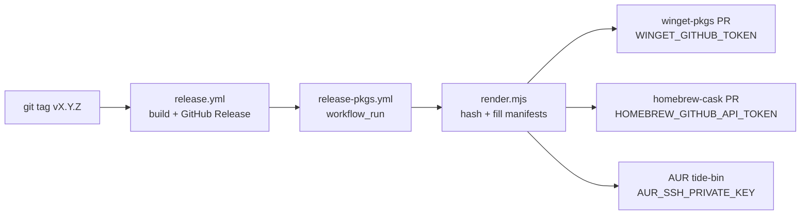

# Packaging manifests (winget · homebrew · AUR)

Distributes Tide's existing GitHub Release installers to the three OS package
managers so users can install with:

```
winget install Tide.Tide            # Windows
brew install --cask tide            # macOS
yay -S tide-bin                     # Linux (Arch / AUR)
```

None of these host binaries themselves — each is a small manifest pointing at
the installers already produced by `.github/workflows/release.yml` (NSIS `.exe`,
macOS `.dmg`, Linux `.deb`). The manifests live in community repos
(winget-pkgs, homebrew-cask) or a self-owned AUR package, and are kept in sync
with each release by `.github/workflows/release-pkgs.yml`.

```
packaging/
├── README.md                         ← this file
├── render.mjs                        ← substitutes @@MARKERS@@ + hashes release assets
├── winget/
│   ├── Tide.Tide.yaml                ← version manifest   ┐ these three form one
│   ├── Tide.Tide.installer.yaml      ← installer manifest │ winget "version dir"
│   └── Tide.Tide.locale.en-US.yaml   ← default locale     ┘
├── homebrew/
│   └── tide.rb                       ← Homebrew cask
└── aur/
    └── PKGBUILD                      ← AUR package (tide-bin)
```

The templates use `@@MARKER@@` placeholders. `render.mjs` downloads each
release asset, streams it through sha256, fills the markers, and writes the
result under `packaging/out/` (gitignored). Run it locally to preview a release:

```bash
node packaging/render.mjs --version 0.1.2-beta --repo code-with-current/tide
# → packaging/out/{winget,homebrew,aur}/…
```

## How a release flows

1. You tag `vX.Y.Z` and push it. `release.yml` builds the installers and
   publishes the GitHub Release (existing flow — unchanged).
2. When that workflow finishes, `release-pkgs.yml` wakes up via `workflow_run`,
   runs `render.mjs` once, then submits to each package index.
3. Each submission step is **gated on a secret** — until you add the secret,
   that platform is skipped with a notice. So committing this pipeline today is
   safe; it's inert until configured.



## One-time setup (per platform)

Every platform needs a **manual first submission** so the package exists. After
that, the automation bumps it on each release.

### Windows — winget (`Tide.Tide`)

1. Make sure the latest release is out (so an installer URL exists).
2. First submission (opens a PR to `microsoft/winget-pkgs`):
   ```bash
   # install Komac: https://github.com/russellbanks/Komac
   komac new Tide.Tide 0.1.2-beta <exe-url> <exe-sha256>
   ```
   or PR the rendered files under `packaging/out/winget/` into
   `manifests/t/Tide/Tide/<version>/` by hand. Once merged, `winget install
   Tide.Tide` works.
3. Create a GitHub **PAT** with `public_repo` + `workflow` scopes and add it as
   the repo secret **`WINGET_GITHUB_TOKEN`**. Subsequent releases bump
   automatically via `komac update … --submit`.

> winget `PackageVersion` must be dotted-numeric (`0.1.2-beta` → `0.1.2.0`).
> `render.mjs` handles this; just be aware a `-beta` and its later stable of the
> same numbers would collide — promote the version (e.g. `0.2.0`) for stable.

### macOS — Homebrew cask (`tide`)

1. Render the current release: `node packaging/render.mjs --version <ver> …`
2. Fork `Homebrew/homebrew-cask`, copy `packaging/out/homebrew/tide.rb` to
   `Casks/t/tide.rb`, then validate and PR:
   ```bash
   brew audit --cask tide
   brew style Casks/t/tide.rb
   ```
3. Add a GitHub **PAT** (`public_repo` + `workflow`) as the secret
   **`HOMEBREW_GITHUB_API_TOKEN`**. Subsequent releases bump automatically via
   `brew bump-cask-pr`.

> Tide's `.app` is **ad-hoc signed** (no Apple Developer ID). Homebrew installs
> casks with `--no-quarantine`, so Gatekeeper is bypassed and the app launches
> directly — no "unidentified developer" dance for `brew` users. Notarization
> would still improve the direct-download experience (see `release.yml` header).

### Linux — AUR (`tide-bin`)

The AUR is self-maintained — there's no PR to wait on.

1. Register at <https://aur.archlinux.org> and upload an SSH public key.
2. Create the package:
   ```bash
   git clone ssh://aur@aur.archlinux.org/tide-bin.git
   node packaging/render.mjs --version <ver> …
   cp packaging/out/aur/PKGBUILD tide-bin/
   cd tide-bin && makepkg --printsrcinfo > .SRCINFO
   git add . && git commit -m "init" && git push
   ```
   `yay -S tide-bin` works immediately.
3. Add the matching **private key** as the secret **`AUR_SSH_PRIVATE_KEY`** (the
   full private-key text). Subsequent releases push the bumped PKGBUILD
   automatically (the workflow runs in an `archlinux` container so `makepkg` can
   regenerate `.SRCINFO`).

> pacman forbids `-` in `pkgver`, so `0.1.2-beta` becomes `0.1.2beta`. The
> PKGBUILD keeps the real version in `_realver` for the asset URL. `render.mjs`
> fills both.

## Secrets summary

| Secret | Platform | Scope needed |
|---|---|---|
| `WINGET_GITHUB_TOKEN` | winget | PAT: `public_repo`, `workflow` |
| `HOMEBREW_GITHUB_API_TOKEN` | homebrew | PAT: `public_repo`, `workflow` |
| `AUR_SSH_PRIVATE_KEY` | AUR | AUR account private key (text) |

Leave any unset to disable that platform — the workflow skips it with a notice.

## Notes & gotchas

- **Artifact names are coupled to `build/build.js`.** If the NSIS/DMG/DEB
  `artifactName` templates change there, update the URL builders in
  `packaging/render.mjs` to match.
- **`LICENSE` file.** Present at the repo root (MIT); winget's `LicenseUrl`
  points at `…/blob/main/LICENSE`.
- **Partial automation is fine.** You can wire up AUR (fully self-served) first
  and add winget/homebrew after their first PRs merge — each job is independent.
- **Inspect before trusting.** Rendered manifests upload as a `manifests`
  workflow artifact (7-day retention) even when a platform's secret is unset, so
  you can review the exact files the pipeline would publish.
