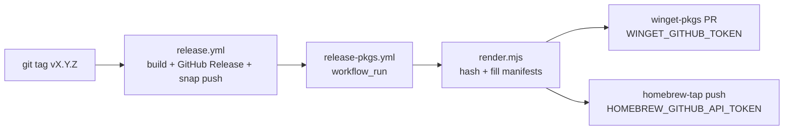

# Packaging manifests (winget · homebrew · snap)

> **Dormant — pending Electrobun-native packaging.** This pipeline is
> electron-era and disabled: `.github/workflows/release-pkgs.yml` was renamed
> to `release-pkgs.disabled.yml` (manual dispatch only) because it renders
> electron-builder artifact names (`*-Setup.exe`, `*-x64.dmg`, `*_amd64.deb`)
> for `v*`-tagged releases — none of which the Electrobun `tide/v*` release
> flow produces (it emits `*.tar.zst` update envelopes, `*-update.json`, and
> differently-named per-target installers; see `build/build.js`). Everything
> below is retained as the starting point for a future Electrobun-native
> packaging flow; the workflow file's header lists what a revival requires.

Distributes Tide's existing GitHub Release installers to the three OS package
managers so users can install with:

```
winget install Tide.Tide                        # Windows
brew install --cask code-with-current/tap/tide  # macOS
snap install tide                               # Linux (Snap Store)
```

winget and homebrew use small manifest files pointing at the installers already
produced by `.github/workflows/release.yml` (NSIS `.exe`, macOS `.dmg`). Snap is
built natively by electron-builder and published to the Snap Store directly in
`release.yml`. The manifests are kept in sync with each release by
`.github/workflows/release-pkgs.yml`.

> macOS uses our own tap (`code-with-current/homebrew-tap`) rather than the
> official `Homebrew/homebrew-cask`, which has notability requirements that
> Tide doesn't meet yet.

```
packaging/
├── README.md                         ← this file
├── render.mjs                        ← substitutes @@MARKERS@@ + hashes release assets
├── winget/
│   ├── Tide.Tide.yaml                ← version manifest   ┐ these three form one
│   ├── Tide.Tide.installer.yaml      ← installer manifest │ winget "version dir"
│   └── Tide.Tide.locale.en-US.yaml   ← default locale     ┘
└── homebrew/
    └── tide.rb                       ← Homebrew cask
```

The templates use `@@MARKER@@` placeholders. `render.mjs` downloads each
release asset, streams it through sha256, fills the markers, and writes the
result under `packaging/out/` (gitignored). Run it locally to preview a release:

```bash
node packaging/render.mjs --version 0.1.2-beta --repo code-with-current/tide
# → packaging/out/{winget,homebrew}/…
```

## How a release flows

1. You tag `vX.Y.Z` and push it. `release.yml` builds the installers (including
   a `.snap` for Linux), publishes the GitHub Release, and pushes the snap to
   the Snap Store — all in one workflow.
2. When that workflow finishes, `release-pkgs.yml` wakes up via `workflow_run`,
   runs `render.mjs` once, then submits the winget and homebrew manifests.
3. Each manifest submission is **gated on a secret** — until you add the secret,
   that platform is skipped with a notice. Snap publishing runs from `release.yml`
   and is gated on `SNAPCRAFT_STORE_CREDENTIALS`.



## One-time setup (per platform)

### Windows — winget (`Tide.Tide`)

1. Make sure the latest release is out (so an installer URL exists).
2. First submission (opens a PR to `microsoft/winget-pkgs`):
   ```bash
   # install Komac: https://github.com/russellbanks/Komac
   komac new Tide.Tide 0.1.2-beta <exe-url> <exe-sha256>
   ```
   or PR the rendered files under `packaging/out/winget/` into
   `manifests/t/Tide/Tide/<version>/` by hand. Once merged, `winget install
   Tide.Tide` works.
3. Create a GitHub **PAT** with `public_repo` + `workflow` scopes and add it as
   the repo secret **`WINGET_GITHUB_TOKEN`**. Subsequent releases bump
   automatically via `komac update … --submit`.

> winget `PackageVersion` must be dotted-numeric (`0.1.2-beta` → `0.1.2.0`).
> `render.mjs` handles this; just be aware a `-beta` and its later stable of the
> same numbers would collide — promote the version (e.g. `0.2.0`) for stable.

### macOS — Homebrew tap (`code-with-current/tap`)

No manual first submission needed — the tap repo (`code-with-current/homebrew-tap`)
is ours, so the workflow pushes directly. Users install via:
```
brew install --cask code-with-current/tap/tide
```

Just add a GitHub **PAT** (`public_repo` + `workflow`) as the secret
**`HOMEBREW_GITHUB_API_TOKEN`**. The workflow pushes the rendered cask to
`Casks/tide.rb` in the tap on every release.

> Tide's `.app` is **ad-hoc signed** (no Apple Developer ID). Homebrew installs
> casks with `--no-quarantine`, so Gatekeeper is bypassed and the app launches
> directly — no "unidentified developer" dance for `brew` users. Notarization
> would still improve the direct-download experience (see `release.yml` header).

### Linux — Snap Store (`tide`)

Snap is built natively by electron-builder during `release.yml` and published to
the Snap Store in the same workflow — no manifest files, no external repo.

1. Register the snap name `tide` at <https://snapcraft.io/register>.
2. Generate a login token locally:
   ```bash
   snapcraft export-login -   # outputs credentials text
   ```
3. Store the output as the repo secret **`SNAPCRAFT_STORE_CREDENTIALS`**.

Every tagged release builds the `.snap`, uploads it to the GitHub Release, and
pushes it to the Snap Store via `snapcraft push`. Users install with:
```
snap install tide
```

> The snap uses **strict confinement** by default. For a coding tool that needs
> full filesystem access, consider applying for **classic confinement** via the
> Snap Store request process, then change `confinement` in `build/build.js`.

## Secrets summary

| Secret | Platform | Scope needed |
|---|---|---|
| `WINGET_GITHUB_TOKEN` | winget | PAT: `public_repo`, `workflow` |
| `HOMEBREW_GITHUB_API_TOKEN` | homebrew | PAT: `public_repo`, `workflow` |
| `SNAPCRAFT_STORE_CREDENTIALS` | snap | snapcraft login token (text) |

Leave any unset to disable that platform — the workflow skips it with a notice.

## Notes & gotchas

- **Artifact names are coupled to `build/build.js`.** If the NSIS/DMG/DEB
  `artifactName` templates change there, update the URL builders in
  `packaging/render.mjs` to match.
- **`LICENSE` file.** Present at the repo root (MIT); winget's `LicenseUrl`
  points at `…/blob/master/LICENSE`.
- **Partial automation is fine.** You can wire up snap (fully self-served) first
  and add winget/homebrew after — each job is independent.
- **Inspect before trusting.** Rendered manifests upload as a `manifests`
  workflow artifact (7-day retention) even when a platform's secret is unset, so
  you can review the exact files the pipeline would publish.
